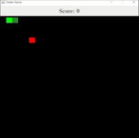

# Snake Game :video_game::snake:

## About The Project :blue_book:

I decided to implement my version of the popular arcade snake game. I should have used paint instead of creating JLabel as my cells, but it ended up working great still. I used the software design pattern MVC to make this game.


 

## Getting Started

1. The first step is to clone the repo
2. Compile the files
3. ```java SnakeGameController```
4.  Play the game! 


